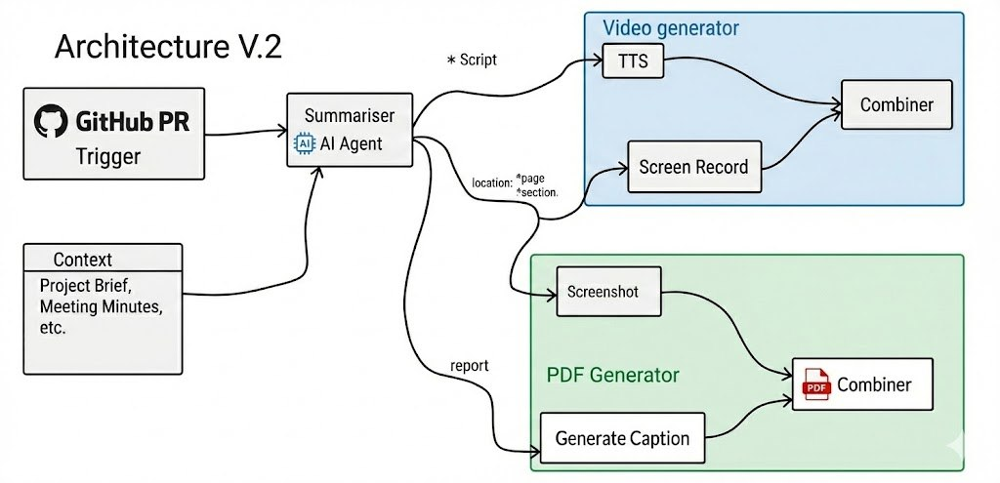

<p align="center">
  
</p>

<h1 align="center">TeamSync</h1>

<p align="center">
  <strong>AI-Powered Client Portal with Automation for Development Teams</strong>
</p>

<p align="center">
  Automatically generate engaging video updates when PRs are merged, keeping stakeholders informed without manual effort.
</p>

---

## ✨ Features

### 🎬 Automated Video Generation
- **GitHub Webhook Integration** — Automatically captures PR merge events
- **AI-Powered Summarization** — Generates concise summaries of code changes using OpenAI
- **Text-to-Speech Narration** — Converts summaries to natural voice narration
- **Visual Screenshots** — Captures relevant screenshots from your live app
- **Video Compilation** — Combines everything into polished video updates
- **PDF Reports** — Generates downloadable update reports with screenshots and descriptions

### 🤖 AI Assistant
- **Context-Aware Chat** — Ask questions about your project and get intelligent responses
- **Project Knowledge** — Understands project scope, updates, and documentation
- **Clarification System** — Facilitates bidirectional communication between developers and reviewers

### 👥 Team Collaboration
- **Role-Based Access** — Separate views for developers and reviewers
- **Add Team Members** — Add existing users to projects by email lookup
- **Update Notifications** — See new video updates as they're generated

### 📊 Project Management
- **Dashboard Overview** — Track project progress and status
- **Update History** — Browse all generated video updates
- **Document Management** — Upload and manage project documentation (PDFs)
- **Progress Tracking** — Monitor milestones and completion status

---

## 🛠️ Tech Stack

| Category | Technologies |
|----------|-------------|
| **Framework** | Next.js 16 (App Router), React 19, TypeScript |
| **Styling** | Tailwind CSS 4, Framer Motion |
| **Database & Auth** | Supabase (PostgreSQL, Auth, Storage) |
| **AI/ML** | OpenAI GPT-4o, OpenAI TTS |
| **Media Processing** | Puppeteer (screenshots), FFmpeg (video) |
| **UI Components** | Radix UI, Lucide Icons, Sonner |

---

## 🚀 Getting Started

### Prerequisites

- Node.js 18+ 
- npm, yarn, pnpm, or bun
- [Supabase](https://supabase.com) account
- [OpenAI API](https://platform.openai.com) key
- FFmpeg installed locally

### Environment Variables

Create a `.env.local` file in the root directory:

```env
# Supabase
NEXT_PUBLIC_SUPABASE_URL=your_supabase_url
NEXT_PUBLIC_SUPABASE_ANON_KEY=your_supabase_anon_key
SUPABASE_SERVICE_ROLE_KEY=your_service_role_key

# OpenAI
OPENAI_API_KEY=your_openai_api_key

# App URL
NEXT_PUBLIC_SITE_URL=your_public_site_url

# Google Services for Report generation
GOOGLE_SERVICE_ACCOUNT_EMAIL=your_google_service_account_email
GOOGLE_PRIVATE_KEY=your_google_private_key
```

### Database Setup

Run the SQL schema in your Supabase SQL Editor:

```bash
# The schema is located at:
supabase_schema.sql
```

This creates all necessary tables, functions, RLS policies, and storage buckets.

### Installation

```bash
# Clone the repository
git clone https://github.com/your-username/teamsync.git
cd teamsync

# Install dependencies
npm install

# Run the development server
npm run dev
```

Open [http://localhost:3000](http://localhost:3000) to see the app.

---

## 📁 Project Structure

```
TeamSync/
├── app/
│   ├── [projectId]/           # Project detail pages
│   │   ├── components/        # Dashboard, Updates, Assistant, Settings tabs
│   │   └── page.tsx          
│   ├── api/                   # API routes
│   │   ├── generate-tts/      # Text-to-speech generation
│   │   ├── generate-video/    # Video compilation
│   │   ├── generate-screenshots/
│   │   ├── projects/          # Project CRUD & features
│   │   └── webhooks/          # GitHub webhook handler
│   ├── login/                 # Authentication
│   └── new/                   # Create new project
├── components/
│   ├── ui/                    # Reusable UI components
│   ├── chat-interface.tsx     # AI chat component
│   └── update-card.tsx        # Update display card
├── lib/
│   ├── github.ts              # GitHub API utilities
│   ├── google-docs.ts         # Google Docs integration
│   ├── storage.ts             # Supabase storage helpers
│   └── webhook-processor.ts   # Webhook event processing
├── utils/supabase/            # Supabase client utilities
└── types/                     # TypeScript type definitions
```

---

## 🔄 How It Works

<p align="center">
  
</p>

### Pipeline Overview

1. **GitHub PR Trigger** — When a PR is merged, GitHub webhook triggers the pipeline
2. **AI Summarizer** — Analyzes PR changes with context from project briefs and meeting minutes
3. **Dual Output Generation:**
   - **Video Generator** — Script → TTS + Screen Recording → Combined video
   - **PDF Generator** — Screenshots + Generated captions → Combined PDF report
4. **Update Available** — New video and PDF appear in the project dashboard

---

## 👤 User Roles

| Role | Sign In Method | Capabilities |
|------|---------------|--------------|
| **Developer** | GitHub OAuth | Create projects, link repos, manage webhooks, full access |
| **Reviewer** | Google OAuth / Email | View updates, use AI assistant, send clarifications |

---

## 📝 API Routes

| Endpoint | Method | Description |
|----------|--------|-------------|
| `/api/webhooks/github` | POST | Receives GitHub webhook events |
| `/api/projects/[id]/generate-video` | POST | Triggers video generation |
| `/api/generate-tts` | POST | Generates TTS audio from script |
| `/api/generate-screenshots` | POST | Captures screenshots |
| `/api/projects/[id]/assistant` | POST | AI assistant chat |
| `/api/projects/[id]/clarifications` | GET/POST | Manage clarifications |

---

## 🔐 Security

- **Row Level Security (RLS)** — Database access controlled at row level
- **Webhook Signature Verification** — GitHub webhooks verified with secret
- **Role-Based Access Control** — Different permissions for developers/reviewers
- **Secure Token Storage** — GitHub tokens stored encrypted in Supabase

---

## 🧪 Scripts

```bash
# Test the full video generation pipeline
node scripts/test-full-pipeline.js

# Test webhook flow
node scripts/test-webhook-flow.js

# Test TTS generation
node scripts/test-tts.js

# Test screenshot capture
node scripts/test-screenshots.js
```

---

## 🙏 Acknowledgments

- [Next.js](https://nextjs.org) — React framework
- [Supabase](https://supabase.com) — Backend as a Service
- [OpenAI](https://openai.com) — AI models for summarization and TTS
- [Vercel](https://vercel.com) — Deployment platform
